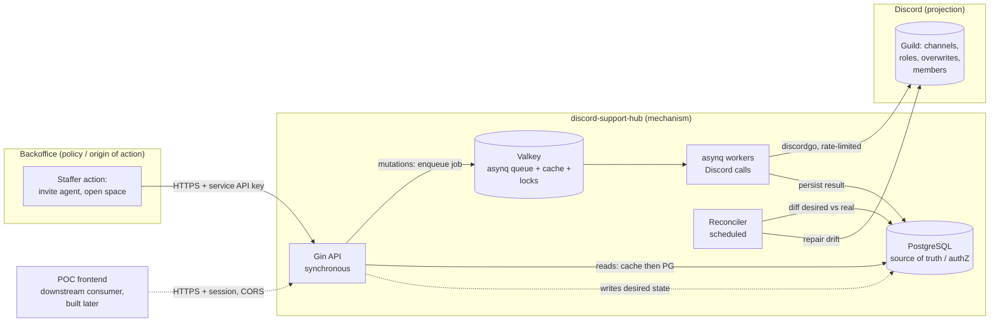
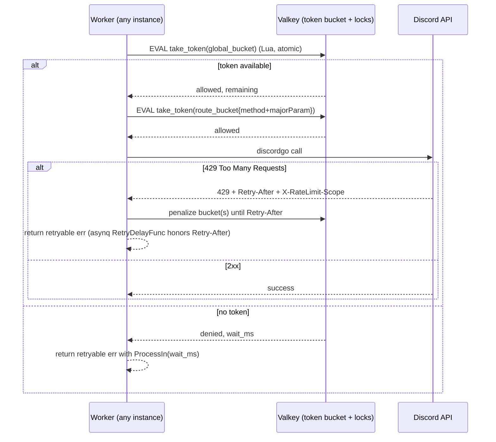
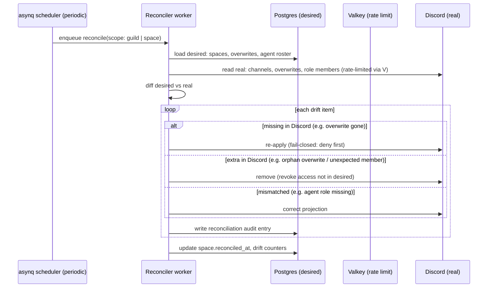

# discord-support-hub — Technical Architecture (M0–M5)

**Date:** 2026-06-09
**Scope:** M0 (skeleton) · M1 (identity & authZ core) · M2 (provisioning vertical slice) · M3 (membership / role-per-merchant / isolation) · M6 (role-per-merchant provisioning + invite storage + email-send) · M7 (read/admin console). M4–M5 covered at a high level only.
**Status:** design artifact — conforms to `01-mvp-scope.md` (scope-locked). No application code in this document.

---

## 0. Documentation consulted

Library APIs verified against current upstream source (context7 + GitHub `master` + pkg.go.dev) on 2026-06-09:

- **discordgo** (`/bwmarrin/discordgo`, BSD-3-Clause): confirmed `GuildRoleCreate(guildID string, data *RoleParams, options ...RequestOption) (*Role, error)` — note the struct is `RoleParams` (`Name string`, `Permissions int64`, `Color int`, `Hoist bool`, `Mentionable bool`), **not** `GuildRoleCreateParams`. Confirmed `GuildChannelCreateComplex(guildID, *GuildChannelCreateData, ...)`, `ChannelPermissionSet(channelID, targetID string, targetType PermissionOverwriteType, allow, deny int64, ...)`, `GuildMemberRoleAdd/Remove(guildID, userID, roleID, ...)`, `GuildRoleDelete(guildID, roleID, ...)`, `GuildMemberNickname`, `ChannelInviteCreate(channelID, Invite, ...)`. Confirmed `PermissionOverwrite{ID, Type, Deny, Allow int64}` and `PermissionOverwriteTypeRole=0` / `PermissionOverwriteTypeMember=1`.
- **Verified Discord-platform constraint (tested live against the test guild):** `POST /channels/{id}/invites` (`ChannelInviteCreate`) creates an invite, but **the `roles` field on the invite body is silently ignored** — attaching a role to an invite is a Discord-client-only feature, not exposed by the bot REST API. Discord permissions are keyed by user-id or role, **never by email**; a user cannot be looked up by email. These two facts drive the onboarding design (§6).
- **asynq** (`/hibiken/asynq`, MIT): confirmed `Client.Enqueue(task, opts...)`, options `Unique(ttl)`, `TaskID(id)`, `MaxRetry(n)`, `Queue(name)`, `Timeout`, `Retention`; server `Config.RetryDelayFunc func(n int, e error, t *Task) time.Duration`, `Config.IsFailure`, and the `SkipRetry` sentinel that archives a task without further retries.
- **Gin** (`/gin-gonic/gin`) + **gin-contrib/cors**: route groups, custom middleware (`c.Next()`, `c.AbortWithStatus`), CORS config.
- **go-redis** (`/redis/go-redis`): `SetNX`, `Eval` (Lua) for atomic token-bucket and lock primitives.
- **SMTP delivery** is performed with the Go standard library `net/smtp` over a config-provided relay (host, port, credentials, from-address); no third-party email SDK is introduced in v1.

Where the design depends on an exact signature, it is quoted inline below.

---

## 1. System context & the three-layer truth model



**Layer 1 — backoffice (origin of action).** A human staffer performs the operational decision ("invite this agent", "open a space for merchant X"). The hub ships **no human UI** in v1; the backoffice is the API consumer.

**Layer 2 — hub Postgres (authorization source of truth).** Every roster fact lives here: a merchant owns exactly one space (1:1) and exactly one **merchant role** (1:1); a collaborator is a global identity granted access to one or more spaces via `space_members` (M:N, possibly spanning merchants); `type=agent|collaborator`; `is_admin`. The collaborator's name and work email are **our labels**, stored here for traceability — they are never a Discord primitive (Discord has no email key). **AuthZ is always resolved against Postgres**, never against the Discord role. This is the invariant that makes every Discord role — Agent and merchant alike — a *projection*, not a *grant*.

**Layer 3 — Discord (projection).** Roles (the Agent role and one role per merchant) and permission overwrites are the rendered consequence of Postgres state. The bot writes them and the reconciler repairs drift. If Discord and Postgres disagree, **Postgres wins** and the reconciler corrects Discord.

The hub never trusts inbound Discord state for an authorization decision. Discord is write-mostly from the hub's perspective; the only reads are for reconciliation (detect drift) and existence checks (idempotency).

---

## 2. Component architecture: synchronous API vs asynchronous workers

The architecture's reason to exist is **robust handling of Discord rate limits**. The split between a fast synchronous API and rate-limited async workers is what makes that robust (NFR-2).

### 2.1 Request taxonomy

| Class | Examples | Path | Response |
| :-- | :-- | :-- | :-- |
| **Mutating (Discord side-effect)** | provision space (creates the merchant role + role-based overwrite), expel, assign agent role, lifecycle change | API validates + writes *desired* state to Postgres → **enqueues an asynq job** → returns **`202 Accepted`** with a `job_id` and a `Location` to poll | `202` + job handle |
| **Mutating (email side-effect)** | send the stored merchant invite link to a registered collaborator | API records *desired* send state → enqueues a `notify` job → worker sends via SMTP → returns `202` | `202` + job handle |
| **Read** | list spaces, directory, space members, collaborator channels, audit (console reads are metadata only; conversation opens via an "Open in Discord" deep link) | API serves from **Valkey cache** (TTL + write-invalidation); cache miss falls through to Postgres and back-fills | `200` |
| **Roster write, no immediate Discord effect** | `POST /agents` records `type=agent` before the agent has joined; `POST /channels/{id}/collaborators` records a collaborator (name+email+space) before the invite is sent | Synchronous Postgres write (`201`), **plus** — for agents — an enqueued reconcile job to project the role once the user exists in the guild | `201` |

A mutating request **never** calls Discord inline. It records intent and returns. This keeps p99 API latency decoupled from Discord's rate-limit budget and from Discord outages.

### 2.2 Why `202`, not `200`

A provisioning call can sit behind a rate-limit bucket for seconds. Blocking the HTTP request on that couples the caller's latency to Discord's. Returning `202` with a pollable `job_id` lets the backoffice (and the future POC frontend) show "provisioning…" and poll `GET /jobs/{id}`. The OpenAPI contract models every mutating endpoint this way.

### 2.3 Job lifecycle

```
enqueue (API)  →  PENDING  →  worker picks up  →  ACTIVE
                                                   │
                        ┌──────────────────────────┼─────────────────────────┐
                        ▼                           ▼                         ▼
                    COMPLETED               RETRY (Retry-After)          ARCHIVED
               (Postgres updated,        (RetryDelayFunc honors        (SkipRetry on
                cache invalidated)        Discord 429/global)           fail-closed error)
```

The `jobs` row in Postgres mirrors the asynq task state so a caller can poll authoritative status without reaching into Valkey (which is not source of truth).

---

## 3. Async + rate-limit design

### 3.1 Two layers of rate-limit defense

discordgo already serializes per-route and honors `Retry-After` *within a single process*. That is **not sufficient** here: multiple workers share one bot token, and Discord's **global** limit (~50 req/s) and per-route buckets are enforced **per bot token across all processes**. We therefore add a **distributed token bucket over Valkey** that all workers consult *before* making a call.



**Global bucket.** One Valkey key, GCRA/token-bucket via an atomic Lua script (`EVAL`). Refill rate set conservatively below Discord's global ceiling (configurable, default ~45/s to leave headroom). Every worker takes a token before any call.

**Per-route buckets.** Keyed by `method + route + majorParameter` (channel id / guild id), mirroring Discord's own bucket model. Discord returns `X-RateLimit-Bucket`, `-Limit`, `-Remaining`, `-Reset`; the worker writes those observed values back into the Valkey route bucket so siblings respect the *actual* server-side bucket, not just a static guess.

**Why a Lua script.** Token-take must be atomic (read remaining + decrement + set reset) to avoid a check-then-act race between workers. `redis.Eval` runs it server-side as a single atomic unit.

### 3.2 Backoff & retry (asynq)

- `RetryDelayFunc func(n int, e error, t *Task) time.Duration` inspects the error. For a `*RateLimitError` carrying `RetryAfter`, it returns exactly that duration (Discord told us when to come back). For generic transient errors, exponential backoff with jitter.
- `MaxRetry(n)` per job class (default raised to e.g. 10 for provisioning; rate-limit retries should not exhaust the budget — they are expected, not failures).
- `IsFailure` is customized so a **rate-limit retry does not increment the failure counter** — it is normal flow, not an error-rate signal (keeps NFR-7 metrics honest).
- A **fail-closed ACL error** (see §4.4) returns `asynq.SkipRetry`: the task is archived immediately, the space is left invisible, and an alert/audit entry is written. We never retry into a half-open ACL.

### 3.3 Per-space and per-merchant locks (NFR-2 race avoidance)

Two jobs touching the same channel (e.g. "create overwrite for user A" and "create overwrite for user B" racing right after channel creation) can clobber each other or act on a not-yet-existing channel. We serialize with a **distributed lock**:

- Lock key `lock:space:{spaceId}` (and `lock:merchant:{merchantId}` for provisioning) acquired via `SET key val NX PX ttl` with a fencing token; released on completion; auto-expires on worker death.
- A worker that cannot acquire the lock re-enqueues itself with a short `ProcessIn` delay rather than blocking a worker slot.
- Locks are **coordination only** — never authoritative. If a lock is lost, the reconciler still converges state; the lock just avoids wasted/conflicting Discord calls.

### 3.4 Queue topology

Distinct asynq queues with priorities so a flood of one class cannot starve another:

| Queue | Priority | Contents |
| :-- | :-- | :-- |
| `provision` | high | merchant-role create, space creation, role-based ACL apply |
| `membership` | high | agent-role assign/remove, expulsion (overwrite/role/member removal), guild member removal |
| `notify` | default | send the stored merchant invite link to a collaborator via SMTP |
| `reconcile` | low | drift detection + repair (scheduled + on-demand) |
| `marking` | low | optional nickname suffix (M4) |

The `notify` queue is isolated so a slow or unreachable SMTP relay back-pressures only email delivery, never space provisioning. Send failures retry with backoff and surface on the job; they never block or fail a provisioning path.

---

## 4. Idempotency + reconciliation model

### 4.1 Idempotency keys (NFR-3)

Every mutating API request carries (or is assigned) an **idempotency key**. The flow:

1. API computes a key: caller-supplied `Idempotency-Key` header **or** a deterministic key derived from `(operation, merchantId, spaceId, userId)` for naturally-idempotent operations.
2. API performs an **atomic insert** into `idempotency_keys (key UNIQUE, request_hash, response, status)`. If the key already exists with a completed response, the API replays the stored response (same `202` + `job_id`) instead of enqueueing a second job. This makes client retries safe at the edge.
3. The enqueued asynq task uses `TaskID(idempotencyKey)` + `Unique(ttl)`. asynq guarantees uniqueness by task id within the TTL, so even a double-enqueue collapses to one task.
4. The worker itself is idempotent against Discord: before creating a channel it checks Postgres for an existing `discord_channel_id` for that `(merchant, desired space)`; before adding an overwrite it checks whether the overwrite already matches desired. "Create" operations are **upserts against desired state**, not blind inserts.

Three layers (API replay → asynq unique task → worker upsert) mean a retry at any layer cannot double-provision.

### 4.2 The desired-vs-real reconciliation loop (NFR-3)

Postgres holds **desired** state. Discord holds **real** state. They drift (manual edits in Discord, partial failures, Discord outages). The reconciler converges them, **Postgres always winning**.



**Drift classes and repair:**

| Drift | Cause | Repair (Postgres wins) |
| :-- | :-- | :-- |
| Merchant role missing for an active space | manual delete / partial failure | re-create the merchant role (`GuildRoleCreate`) and re-store its id |
| Merchant-role channel allow absent in Discord | manual delete / partial failure | re-apply the role allow (deny @everyone re-asserted first) |
| Channel overwrite in Discord for a role/member the DB never blessed | manual add — **isolation breach risk** | **revoke it** (an access the source of truth never granted) |
| Member holds a merchant role the DB does not record for them | manual grant via the Discord client | **remove the role from that member** (membership is not granted by manual role assignment) |
| Agent role missing on a user who is `type=agent` | projection lag | assign the Agent role |
| Agent role present on a non-agent | manual grant | remove the role |
| Channel missing for an active space | manual delete | re-provision the channel |
| `@everyone` allow VIEW_CHANNEL set | manual misconfig | re-assert deny (fail-closed) |

The "extra in Discord → revoke" rule is the teeth of multi-tenant isolation (NFR-5): any access not blessed by Postgres — a stray overwrite or a hand-assigned merchant role on the wrong member — is removed on the next reconcile pass. **Note on the role model:** because access is now role-based, isolation depends on *role membership* matching the desired roster, not on per-user overwrites. The reconciler therefore also diffs **which members carry each merchant role** against `space_members`, removing the role from any member the source of truth does not list. The native invite-with-role binding (§6) is the normal grant path; a manual role assignment in the client is treated as drift. Reconciliation runs (a) on a schedule (e.g. every N minutes per guild), (b) on demand after a job fails, and (c) as a targeted single-space pass after each successful mutation as a cheap consistency check.

### 4.3 Reconciliation triggers

- **Scheduled** full-guild sweep (low-priority `reconcile` queue) — catches manual drift.
- **Post-mutation targeted** sweep of the single affected space — cheap, fast convergence.
- **On-failure** sweep after a job archives — ensures a half-applied change is either completed or rolled back to a safe (invisible) state.

### 4.4 Fail-closed behavior (NFR-4)

The invariant: **a space is never world-readable, even on partial failure.** Channel provisioning order enforces this:

1. **Create the merchant role first** (`GuildRoleCreate` with zero standalone permissions — the role grants nothing on its own; access comes only from the channel allow below). Persist its id on the space. This is idempotent: if the space already has a `merchant_role_id`, reuse it.
2. **Create the channel already denied.** `GuildChannelCreateComplex` is called *with* the `@everyone` deny-VIEW_CHANNEL overwrite in the initial `PermissionOverwrites`, so the channel is invisible from the instant it exists — there is no window where it is visible.
3. Apply the **merchant-role allow** (`ChannelPermissionSet`, `PermissionOverwriteTypeRole`, allow VIEW_CHANNEL+SEND_MESSAGES) on the channel, and the Agent-role allow at the category level.
4. If **any** ACL step fails, the worker returns `asynq.SkipRetry` → the task archives, the space row is marked `acl_state = failed`, an alert + audit entry are written, and **no further access is granted**. The channel remains visible only to the bot (and Agents via category, if that step succeeded) — never to `@everyone`. A merchant role that was created but whose channel allow failed grants nothing (the role carries no standalone permission), so a half-applied state is still fail-closed.

A space whose ACL apply failed is reported as `degraded` and is a reconciler target until repaired. We fail toward *no access*, never toward *open access*.

---

## 5. AuthZ model — two layers

### 5.1 Layer A — backoffice → hub API authentication

**Decision: service API keys (opaque bearer tokens), hashed at rest, sent as `Authorization: Bearer <key>`.**

Rationale (justifying the concrete mechanism):

- The primary caller is **one trusted server** (the backoffice), machine-to-machine. A signed service credential is the right shape — no interactive login, no user identity to federate in v1.
- **Opaque random keys (not JWT)** because: (a) the hub is the only validator, so self-contained JWT verification buys nothing; (b) opaque keys are **instantly revocable** (delete the row) without a JWT blocklist; (c) no signing-key rotation machinery needed in v1. We store only a **hash** (`api_keys.key_hash`, e.g. SHA-256/argon2id), compare on each request, and never log the raw key.
- Keys carry a **scope** (`backoffice` full control-plane, or narrower) and a `name`/`merchant_id` binding for audit attribution — every audited action records *which* key acted.
- **Rotation:** multiple active keys per principal allow zero-downtime rotation (issue new, migrate caller, revoke old).

The auth middleware (Gin) extracts the bearer token, hashes it, looks up the active key row, and on success injects a `Principal` into the request context. Failure → `401`, aborted before any handler runs.

### 5.2 Layer B — per-request authorization against Postgres (NFR-13)

After authentication, **authorization resolves against Postgres**, never against Discord:

- **Control-plane authority.** Roster management and the other control-plane operations require *control-plane authority*, which is conferred by **either** of two Postgres-anchored facts:
  - a **service API key** whose `api_keys.scope = backoffice` — a server-side value set at key creation (never client-supplied), representing the trusted backoffice caller (§5.1); **or**
  - a future **user/session principal** with `users.is_admin = true`.

  Both are resolved against Postgres; neither is derived from any client-controllable input (header, body, or a self-asserted role), so there is no privilege-escalation path (CWE-639). The single logical caller in v1 is the backoffice service key.
- The middleware/handler loads the relevant roster facts (the authenticated principal's `api_keys.scope`, or `users.type` / `users.is_admin` / `space_members`) and decides:
  - `POST /agents`, `DELETE /agents/{id}`, `GET /agents` → require **control-plane authority** (backoffice-scoped key or `is_admin` user) — the roster-management safeguard.
  - Invite / expel / lifecycle → require the backoffice service principal (or, later, an Agent/Admin user principal).
  - Read endpoints scoped so a request can only see what the principal is entitled to.
- **Collaborator entitlement is per-space, not per-merchant.** "Is this principal entitled to space S?" resolves to "does a `space_members` row link this user to S?" — there is no `user → merchant` binding to scope against. A collaborator may hold rows for spaces across several merchants and is entitled only to those. Merchant ownership applies to the **space** (each space has one merchant), not to collaborator scoping. (The merchant *role* is how the entitlement is *projected* into Discord; the entitlement itself is the `space_members` row in Postgres.)
- The decision is a pure function of Postgres state. Even if Discord shows someone with the Agent role or a merchant role, if Postgres does not record the corresponding fact they are **not** authorized, and the reconciler strips the unrecorded role. This is `MANAGE_ROLES` reserved-to-the-bot (NFR-13) made concrete: every Discord role — Agent and merchant alike — is not a grant, it is a projection.

### 5.3 Access model — role per merchant (and the 250-role ceiling)

Each merchant owns **one Discord role** (`Merchant: <name>` or a configured template), created automatically by the API on space provision (`GuildRoleCreate`). The merchant's channel denies `@everyone` VIEW (fail-closed, unchanged) and **allows the merchant role** VIEW_CHANNEL+SEND_MESSAGES; the Agent role allow at the category level is unchanged. A collaborator acquires the role by joining through the merchant's native invite-with-role link (§6.2). This **replaces** per-user channel overwrites for collaborators.

**This reverses the original requirement (§00-requirements §4.3, "no per-merchant roles", rejected for the 250-role cap).** The reversal is deliberate: OAuth2 `guilds.join` per-user onboarding did not fit the operator's deployment (it requires a publicly-reachable callback and a per-user browser authorize step they will not host). Native invite-with-role removes both, at the cost of one role per merchant.

**Known ceiling.** Discord caps a server at **250 roles** (the Agent role and any system roles count against it). With one role per merchant this model is comfortable at the ~50-merchant target and viable to roughly ~200 merchants. Past that it breaks and would require reverting to per-user overwrites for collaborators, or multi-guild sharding. This is an explicit, documented constraint, not an oversight — see §10 risks.

### 5.3 The future POC frontend (downstream consumer)

A browser POC frontend will be built **after** the API is complete. It is a downstream consumer, **not** part of this build scope, but the API must be cleanly consumable by it:

- **CORS:** `gin-contrib/cors` configured with an **allowlist** of frontend origins (from config, never `*` when credentials are involved), explicit allowed methods/headers, and `AllowCredentials` only for the session-cookie path. Default config ships locked-down; operator adds the POC origin.
- **Frontend-appropriate auth path:** a service API key must **never** ship to a browser. The design reserves a **session-based path** for the frontend: the POC authenticates a human (the simplest v1 option is an operator-issued session against the backoffice, or a short-lived hub session token minted server-side), and the browser sends a session cookie / short-lived token — not the long-lived service key. Concretely, the API supports two principal types behind the same authorization layer (§5.2): `service` (backoffice key) and `session` (frontend). Both resolve authZ against Postgres identically; only the *authentication* differs. **Building the session issuer is out of scope here; reserving the seam is not.**
- The `202 + job polling` model and JSON contracts are already browser-friendly (no streaming, no server-push needed for v1).

---

## 6. Onboarding sequences (end-to-end)

The two roles reach their access differently:

- An **agent** gets the **Agent role** (category-level VIEW_CHANNEL = all spaces). Agents are internal team members already in the guild, or added by an admin; the Agent role is the projection of `type=agent`.
- A **collaborator** reaches a merchant's space by holding that **merchant's role**. The merchant role is created automatically on space provision and carries the channel allow; a collaborator acquires it by joining through a **native Discord invite-with-role link** that the operator creates once per merchant in the Discord client and that the hub stores and emails. There are no per-user channel overwrites for collaborators.

This rests on a verified platform constraint: the bot REST API can create an invite but **cannot attach a role to it** (the `roles` field is silently ignored — see §0). "Invite roles" is a Discord-client-only feature. The hub therefore does not try to mint role-bearing invites programmatically; it stores the one made by hand and drives the rest (registration, traceability, email) by API.

### 6.1 Agent onboarding

```mermaid
sequenceDiagram
  actor Admin
  participant BO as backoffice
  participant API as Hub API (Gin)
  participant PG as Postgres
  participant Q as asynq/Valkey
  participant W as Worker
  participant D as Discord guild

  Admin->>BO: "Add agent (is_admin?)"
  BO->>API: POST /agents {discord_user_id?, email, name, is_admin}  (Bearer service key)
  API->>PG: INSERT user(type=agent, is_admin) [authZ source of truth]
  API-->>BO: 201 (agent recorded)
  Note over PG: Agent role projected once the user is present in the guild
  API->>Q: enqueue project_agent_role (TaskID = idem key)
  W->>D: GuildMemberRoleAdd(guildID, discordUserID, agentRoleID)
  W->>PG: mark user provisioned; audit entry
```

Key facts:
- The Agent role grants `VIEW_CHANNEL` via **one category-level overwrite** (`PermissionOverwriteTypeRole`), so a new agent sees every space immediately (FR-6) with no per-space work.
- `MANAGE_ROLES` is reserved to the bot, so the Agent role is not self-assignable (NFR-13).
- The agent's `discord_user_id` is supplied by the admin (agents are known team members); the role is projected with `GuildMemberRoleAdd` once they are in the guild, and the reconciler keeps it in sync.

### 6.2 Collaborator onboarding (invite-with-role, our-email)

Two operator-prepared, once-per-merchant facts make this work:

1. On space provision, the **API auto-creates the merchant role** (`GuildRoleCreate`) and the role-based channel allow (§4.4) — fully automatic.
2. The **operator creates one native invite-with-role link** in the Discord client (the "Roles (opcional)" dialog), binding that invite to the merchant role, and stores it against the merchant (`PUT /merchants/{id}/invite`). This is the single non-automatable step (the REST API cannot attach a role to an invite). The link is reusable for every collaborator of that merchant.

Per-collaborator onboarding is then fully by API:

```mermaid
sequenceDiagram
  actor Agent
  participant BO as backoffice
  participant API as Hub API
  participant PG as Postgres
  participant Q as asynq/Valkey
  participant W as Worker
  participant SMTP as SMTP relay (ours)
  participant Collab as Collaborator
  participant D as Discord guild/channel

  Agent->>BO: "Invite <name/email> to space S"
  BO->>API: POST /channels/{S}/collaborators {name, email}  (Bearer)
  API->>PG: authZ: principal is Agent? space S exists? [against Postgres]
  API->>PG: INSERT space_member(space=S, collaborator, role=collaborator) DESIRED + store name/email (our labels)
  API-->>BO: 201 (collaborator registered)
  Agent->>BO: "Send invitation"
  BO->>API: POST /channels/{S}/collaborators/{userId}:send-invite  (Bearer)
  API->>PG: read merchant invite_link for space S's merchant
  API->>Q: enqueue notify job (TaskID = idem key)
  API-->>BO: 202 + job_id
  W->>SMTP: send email {to: collaborator email, body: welcome + invite_link}
  W->>PG: mark invite_sent_at; audit entry
  Collab->>D: clicks invite link → joins guild
  Note over Collab,D: Discord's native invite-with-role assigns the merchant role on join
  D-->>Collab: merchant channel now visible (role allow); #bienvenida visible to @everyone
```

Key facts:
- The collaborator's name and work email live in **our Postgres** for traceability — they are our labels, never a Discord lookup key (Discord cannot resolve a user by email).
- Access is **role-based**: the merchant role's channel allow grants VIEW+SEND. A collaborator sees only their merchant's channel (their role's allow), never another merchant's — isolation by construction (NFR-5). One collaborator invited to spaces of several merchants holds several merchant roles.
- The worker stays **REST-only**: no gateway connection, no Server Members Intent. The hub never observes the join event; it does not need to — the role binding is handled natively by Discord's invite-with-role. The collaborator's `discord_user_id` may be backfilled later (reconciler / console read) but is not required to grant access.
- **The hub sends the email** (our SMTP relay + a configurable welcome message); Discord does not. Email send is a `notify`-queue job, decoupled from provisioning.
- A `#bienvenida` channel visible to `@everyone` carries a configurable welcome message, so a joiner lands somewhere before their role-gated channel resolves.

### 6.3 Expulsion (FR-19, scope param)

`DELETE /channels/{id}/collaborators/{userId}?scope=channel|server`:
- `scope=channel` (**default**, least-destructive): remove the **merchant role** from that member (`GuildMemberRoleRemove`) when the collaborator belongs to only this space's merchant; the person stays in the guild but loses the channel. Reversible (re-invite re-adds via the stored link, or the reconciler re-grants from a restored desired row).
- `scope=server`: also `GuildMemberRemove` — removes from the guild entirely (which drops all roles).
- Both delete the `space_member` desired row and write an audit entry. The reconciler guarantees the Discord side matches: any member still carrying a merchant role the source of truth no longer lists has it removed.
- **Caveat — shared role membership:** because access is role-based, removing the role expels the member from *every* space of that merchant. At the 1:1 merchant↔space cardinality this is exactly one space, so channel-scope expulsion is unambiguous. (Were a merchant ever to own several spaces, role-based access would expel from all of them at once — out of scope at current cardinality, noted in §10.)

---

## 7. Secret handling (NFR-6)

Two app-level secret classes: the **bot token** and the **SMTP relay credentials**. There are no per-user customer credentials to store — dropping OAuth2 removed the `oauth_tokens` class entirely (no access/refresh tokens, no AES-GCM token store, no per-user encryption at rest). Onboarding now carries no Discord credential; the collaborator's name and email are traceability labels, not secrets, though email is PII (see retention, NFR-12).

- **Bot token:** never in the DB; injected via env/secret manager (NFR-10 config-by-env), loaded once at boot into the discordgo session.
- **SMTP credentials:** host, port, username, password, and from-address are config-by-env (NFR-10); the password is never persisted in Postgres and never logged. The worker loads them at boot for the `notify` queue.
- **Log redaction:** a structured-logging hook redacts known secret fields (`bot_token`, `smtp_password`, `Authorization`, `api_key`) to `***REDACTED***` before any log line is emitted. Audit entries store *references* (user id, action) never secrets. The invite link stored against a merchant is operational data, not a secret, but is treated as sensitive (it grants guild entry) and is not emitted to logs.
- The `api_keys.key_hash` mechanism (Layer A, §5.1) is unchanged: opaque service keys hashed at rest, instantly revocable.

---

## 8. Go project / module layout (skeleton, M0)

```
discord-support-hub/
├── cmd/
│   ├── api/main.go            # Gin HTTP server entrypoint
│   ├── worker/main.go         # asynq worker entrypoint
│   └── reconciler/main.go     # scheduled reconcile entrypoint (or asynq scheduler in worker)
├── internal/
│   ├── config/                # env/file config loader, sane defaults (FR-13, NFR-10)
│   ├── api/
│   │   ├── router.go          # Gin router, route groups, CORS
│   │   ├── middleware/        # auth (Layer A), authz (Layer B), idempotency, request-id, recovery
│   │   └── handlers/          # spaces, collaborators, agents, merchants(+invite), directory, audit, console, jobs
│   ├── authz/                 # Postgres-resolved decisions (Layer B), Principal types
│   ├── domain/                # entities: Merchant, User, Space, SpaceMember, CollaboratorInvite, AuditEntry (no infra deps)
│   ├── store/                 # storage interface (NFR-8 pluggable) + postgres impl (pgx), migrations
│   ├── discord/               # discordgo wrapper: role create/delete, channel create, overwrites, role assign/remove, nick, invite read
│   ├── queue/                 # asynq client + task payload types + task IDs/idempotency
│   ├── worker/                # asynq handlers: provision (role+channel), membership, notify (email), reconcile, marking
│   ├── ratelimit/             # Valkey distributed token bucket (global + per-route, Lua)
│   ├── lock/                  # Valkey distributed locks (per-space, per-merchant)
│   ├── reconcile/             # desired-vs-real diff + repair engine (incl. role-membership diff)
│   ├── secrets/               # log redaction hook, config-by-env secret loading (bot token, SMTP creds)
│   ├── email/                 # SMTP sender (net/smtp): render welcome+invite body, send via relay
│   ├── cache/                 # Valkey read cache: get/set/invalidate, TTL
│   └── observability/         # structured logging, metrics, health, (OTel seam for v1.1)
├── migrations/                # SQL migrations (data-model.sql is the consolidated reference)
├── api/openapi.yaml           # the v1 contract (mirrors docs/openapi.yaml)
├── deploy/
│   ├── Dockerfile             # single static binary image (NFR-10)
│   └── docker-compose.yml     # local: api + worker + postgres + valkey
├── docs/                      # this design set + test-guild setup guide (M0)
└── test/
    └── integration/           # isolation invariant suite (NFR-5 gate, M3)
```

Boundaries: `domain` has no infra imports; `store`/`discord`/`queue`/`cache`/`ratelimit`/`lock` are adapters behind interfaces (NFR-8 pluggable storage). `api` and `worker` are the two composition roots that wire adapters together.

---

## 9. M4 / M5 / M6 / M7 (high level)

- **M4 — Lifecycle, audit, visibility, marking.** Space lifecycle state machine (active→resolved→archived, reopen) already modeled in the schema (`spaces.lifecycle_state`); archive = lock channel + hide, never delete history (FR-7). Audit log endpoint over the `audit_log` table (FR-14). Static help-desk presence = channel topic + a pinned message applied at provisioning (FR-15 static), plus the `#bienvenida` welcome channel (visible to `@everyone`, configurable message). Optional configurable nickname suffix via `GuildMemberNickname` (FR-24, off by default).
- **M5 — OSS hardening.** Integration tests against a throwaway test guild (the isolation suite from M3 becomes the gate), structured logs + minimal metrics (provisioning latency, active spaces, rate-limit hits, errors) + health checks (NFR-7 v1 form), Docker image, README/CHANGELOG/Apache-2.0 license, first tagged `v0.1.0`. Full OTel tracing is v1.1.
- **M6 — Role-per-merchant provisioning + invite storage + email send (the pivot core).** Provision auto-creates the merchant role (`GuildRoleCreate`) + role-based channel allow; store the merchant invite link (`PUT /merchants/{id}/invite`); register a collaborator by name+email+space (`POST /channels/{id}/collaborators`); send the stored invite via the SMTP `notify` queue (`:send-invite`); reconciler diffs role membership. Removes the OAuth2 callback, `oauth_tokens`, HMAC `state`, AES-GCM token store, and per-user collaborator overwrites.
- **M7 — Read/admin console.** Backoffice-facing read surface: view users per space (exists via directory/members), an **"Open in Discord" deep link** per space/channel (`https://discord.com/channels/{guildId}/{channelId}`) so an operator jumps straight to the conversation in Discord, delete users (`scope=server` expel — exists), assign agent roles (roster + role projection — exists). **Reading message content in the console is deferred to the v2 FR-8 mirror** — the console is metadata + deep-link only, so the bot needs no privileged Message Content Intent.

---

## 10. Risks, trade-offs & assumptions

### Trade-offs

- **`202` async everywhere for mutations** trades immediate confirmation for latency isolation from Discord. The backoffice/POC must poll. Justified: the whole point is decoupling from rate limits. *(Chosen over synchronous-with-timeout, which couples caller latency to Discord.)*
- **Opaque service API keys over OAuth2/JWT for backoffice→hub.** Simpler, instantly revocable, no signing infra — right for one trusted machine caller in v1. *(Chosen over JWT, which adds verification/rotation machinery with no validator-distribution benefit here.)*
- **Role per merchant + native invite-with-role over OAuth2 `guilds.join`.** Native invites need no public callback and no per-user browser authorize step, which is why the operator chose them. The cost is one Discord role per merchant against the 250-role cap (viable to ~200 merchants) and one manual operator step per merchant (create the invite-with-role link in the client, since the REST API cannot attach a role to an invite). *(Chosen over OAuth2, which fit neither the deployment nor the operational model; chosen over a gateway listener + Server Members Intent auto-assign, which adds a stateful gateway component for no benefit at this scale.)*
- **We send the invite email ourselves (SMTP) rather than relying on Discord.** Discord does not email invites; owning the send gives a configurable welcome message and a delivery audit, at the cost of an SMTP dependency and PII (the collaborator email) in our store.
- **Distributed token bucket in addition to discordgo's built-in limiter.** discordgo's limiter is per-process; multiple workers share one token's budget, so a cross-process bucket is mandatory. Adds Valkey Lua complexity. Unavoidable given multi-worker + one bot token.
- **Postgres-always-wins reconciliation revokes manual Discord edits.** A staffer who manually grants channel access — or hand-assigns a merchant role to the wrong member — in Discord will have it revoked on the next sweep. This is intentional (isolation invariant) but must be documented so operators don't fight the reconciler. The one expected manual edit (the operator creating the invite-with-role link) is not reconciler-visible: the hub does not manage invite objects, only stores the link string.

### Risks

| Risk | Severity | Mitigation |
| :-- | :-- | :-- |
| **250-role ceiling** — one role per merchant exhausts Discord's per-server role cap | medium (low at ~50 merchants) | Comfortable at the ~50-merchant target; viable to ~200. Track role count as a metric; alert as it approaches the cap. Past ~200, revert collaborators to per-user overwrites or shard across guilds. Documented as a known constraint (§5.3), not an oversight. |
| **Manual invite-with-role step** — the operator must create the invite link by hand in the Discord client (REST API cannot attach a role to an invite) | medium | One-time per merchant, reusable for all that merchant's collaborators. The hub validates an invite link is stored before allowing `:send-invite` (returns a clear `409`/`422` if missing). A setup-guide screenshot walks the "Roles (opcional)" dialog. |
| **SMTP dependency** — invite emails fail if the relay is down/misconfigured | medium | `notify` queue is isolated (a slow relay never blocks provisioning); send failures retry with backoff and surface on the job; an operator can re-trigger `:send-invite`. Config validated at boot; a health check pings the relay. |
| **Email is PII in our store** | medium | Collaborator email stored for traceability; redacted in logs; covered by the NFR-12 retention/deletion policy (deletion-on-offboard couples to the v2 flow). |
| Rate-limit bucket estimate wrong → 429 storms | medium | Seed buckets from Discord's response headers (observed, not guessed); conservative global refill; `RetryDelayFunc` honors `Retry-After` exactly. |
| Reconciler revokes a legitimately-needed access not yet in Postgres (write race) | medium | Targeted post-mutation reconcile only after the desired row is committed; full sweep reads a consistent Postgres snapshot. Desired write precedes job enqueue. The role-membership diff runs only after a collaborator's desired row is committed. |
| Channel budget (500/guild, 50/category) hit | low at ~50 merchants | In scope only at channel mode for ~50 merchants; schema tracks `category` and the design notes the ceiling. Thread mode is dropped per scope, not designed here. |
| Operator needs to read a conversation from the console | low | Resolved: the console offers an **"Open in Discord" deep link** (`https://discord.com/channels/{guildId}/{channelId}`), not an in-app message view. The bot needs **no** privileged Message Content Intent in v1; in-console message content is deferred to the v2 FR-8 mirror. |
| Lock held by a dead worker | low | `SET NX PX` TTL auto-expires; fencing token prevents a revived stale worker from acting; reconciler converges regardless. |

### Assumptions

1. **One trusted backoffice caller** for the service-key auth in v1 (multiple keys allowed for rotation, but a single logical principal). If multiple distinct backoffice systems appear, scopes already accommodate them.
2. **One guild** (no multi-guild sharding — explicitly out of scope). `guild_id` is configuration, not a per-row dimension that needs sharding logic.
3. **Cardinality is fixed: merchant↔space is 1:1, collaborator↔space is M:N.** Each merchant owns exactly one space, enforced by `UNIQUE (merchant_id)` on `spaces`; lifecycle (archive/reopen) acts on that single space. A collaborator is a global external identity that may be granted access to several spaces across different merchants via `space_members`; a collaborator's tenant associations are derived from space membership, never from a `user → merchant` column.
4. **Valkey is cache + coordination only.** No authorization or roster fact is ever read from Valkey for a decision. A total Valkey loss degrades throughput (cold cache, locks unavailable → workers back off) but cannot cause an isolation breach.
5. **The POC frontend is downstream and out of build scope.** Only the CORS config and the session-principal seam are reserved here; the session issuer is not built in M0–M3.

### Open items needing an operator decision

1. **Console message-read: in-scope at M7 or deferred to v2?** Viewing chats/messages from the backoffice console needs either (a) the bot's **Message Content Intent** (privileged) plus live channel reads, or (b) the deferred **FR-8 message mirror** (v2). Recommendation: **defer to v2** and ship M7 with metadata reads only (who is in which space, audit, directory). Reading message content broadens the bot's data surface and couples the console to the privileged intent for a capability the conversation already provides inside Discord; the mirror is the cleaner home for it. Operator to confirm.
2. **Frontend session mechanism** — when the POC is built, will the human session be minted by the hub (a `/auth/session` endpoint) or delegated to the backoffice's existing auth? The seam supports either; the choice is deferred until the POC starts.
3. **Test guild + bot application** — operational prerequisite (not a design decision) needed before M2/M6 runs for real; the M0 setup guide covers creation (and now the per-merchant invite-with-role dialog).
