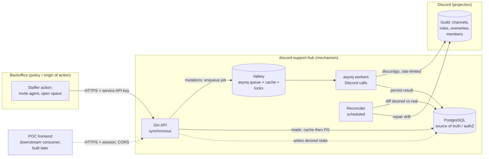
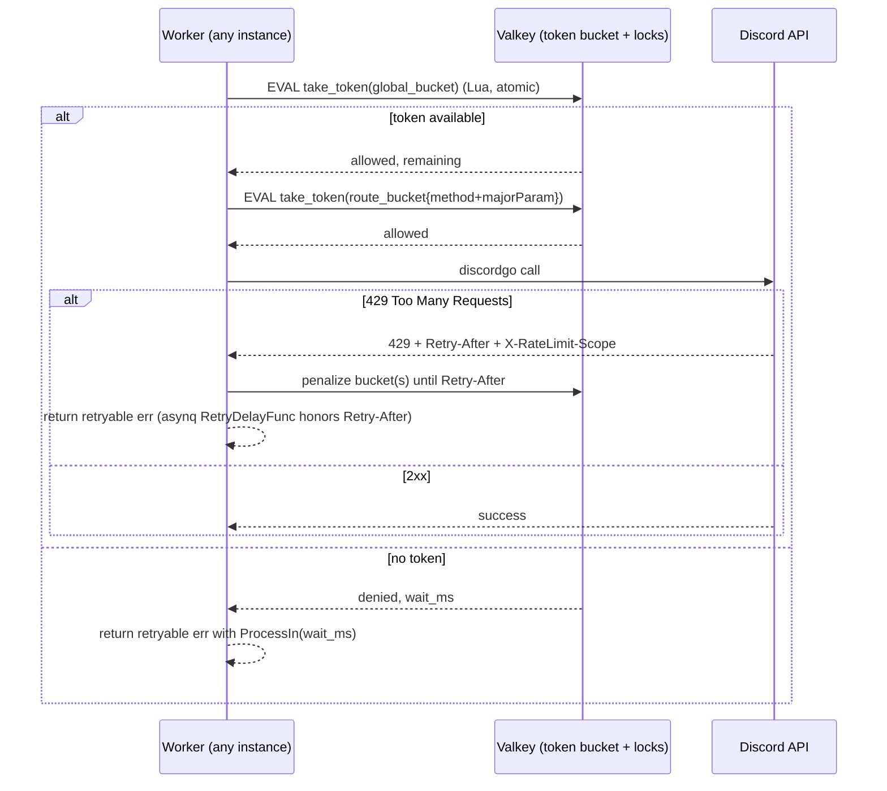
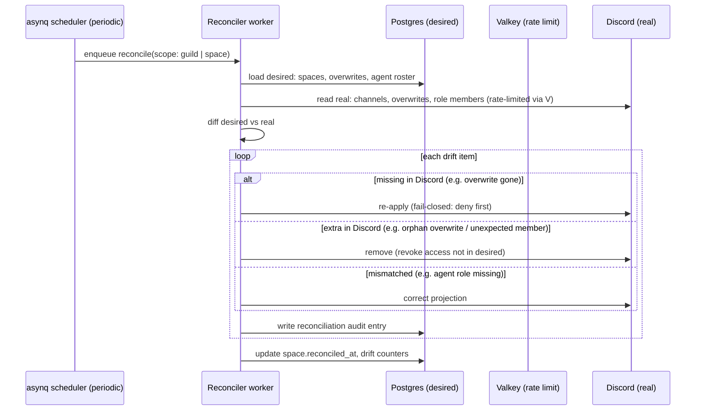

# discord-support-hub — Technical Architecture (M0–M3)

**Date:** 2026-06-08
**Scope:** M0 (skeleton) · M1 (identity & authZ core) · M2 (provisioning vertical slice) · M3 (membership / OAuth2 entry / isolation). M4–M5 covered at a high level only.
**Status:** design artifact — conforms to `01-mvp-scope.md` (scope-locked). No application code in this document.

---

## 0. Documentation consulted

Library APIs verified against current upstream source (context7 + GitHub `master`) on 2026-06-08:

- **discordgo** (`/bwmarrin/discordgo`, BSD-3-Clause): confirmed `GuildChannelCreateComplex`, `ChannelPermissionSet(channelID, targetID, targetType, allow, deny int64)`, `GuildMemberAdd(guildID, userID, *GuildMemberAddParams)`, `GuildMemberRoleAdd/Remove`, `GuildMemberNickname`. Confirmed `GuildMemberAddParams.AccessToken` (the OAuth2 `guilds.join` token), `PermissionOverwrite{ID, Type, Deny, Allow int64}`, and `PermissionOverwriteTypeRole=0` / `PermissionOverwriteTypeMember=1`.
- **asynq** (`/hibiken/asynq`, MIT): confirmed `Client.Enqueue(task, opts...)`, options `Unique(ttl)`, `TaskID(id)`, `MaxRetry(n)`, `Queue(name)`, `Timeout`, `Retention`; server `Config.RetryDelayFunc func(n int, e error, t *Task) time.Duration`, `Config.IsFailure`, and the `SkipRetry` sentinel that archives a task without further retries.
- **Gin** (`/gin-gonic/gin`) + **gin-contrib/cors**: route groups, custom middleware (`c.Next()`, `c.AbortWithStatus`), CORS config.
- **go-redis** (`/redis/go-redis`): `SetNX`, `Eval` (Lua) for atomic token-bucket and lock primitives.

Where the design depends on an exact signature, it is quoted inline below.

---

## 1. System context & the three-layer truth model



**Layer 1 — backoffice (origin of action).** A human staffer performs the operational decision ("invite this agent", "open a space for merchant X"). The hub ships **no human UI** in v1; the backoffice is the API consumer.

**Layer 2 — hub Postgres (authorization source of truth).** Every roster fact lives here: a merchant owns exactly one space (1:1); a collaborator is a global identity granted access to one or more spaces via `space_members` (M:N, possibly spanning merchants); `type=agent|collaborator`; `is_admin`. **AuthZ is always resolved against Postgres**, never against the Discord role. This is the invariant that makes the Discord role a *projection*, not a *grant*.

**Layer 3 — Discord (projection).** Roles and permission overwrites are the rendered consequence of Postgres state. The bot writes them and the reconciler repairs drift. If Discord and Postgres disagree, **Postgres wins** and the reconciler corrects Discord.

The hub never trusts inbound Discord state for an authorization decision. Discord is write-mostly from the hub's perspective; the only reads are for reconciliation (detect drift) and existence checks (idempotency).

---

## 2. Component architecture: synchronous API vs asynchronous workers

The architecture's reason to exist is **robust handling of Discord rate limits**. The split between a fast synchronous API and rate-limited async workers is what makes that robust (NFR-2).

### 2.1 Request taxonomy

| Class | Examples | Path | Response |
| :-- | :-- | :-- | :-- |
| **Mutating (Discord side-effect)** | provision space, invite collaborator, expel, assign agent role, lifecycle change | API validates + writes *desired* state to Postgres → **enqueues an asynq job** → returns **`202 Accepted`** with a `job_id` and a `Location` to poll | `202` + job handle |
| **Read** | list spaces, directory, space members, collaborator channels, audit | API serves from **Valkey cache** (TTL + write-invalidation); cache miss falls through to Postgres and back-fills | `200` |
| **Roster write, no immediate Discord effect** | `POST /agents` records `type=agent` before the agent has connected | Synchronous Postgres write (`201`), **plus** an enqueued reconcile job to project the role once the user exists in the guild | `201` + async projection |

A mutating request **never** calls Discord inline. It records intent and returns. This keeps p99 API latency decoupled from Discord's rate-limit budget and from Discord outages.

### 2.2 Why `202`, not `200`

A provisioning call can sit behind a rate-limit bucket for seconds. Blocking the HTTP request on that couples the caller's latency to Discord's. Returning `202` with a pollable `job_id` lets the backoffice (and the future POC frontend) show "provisioning…" and poll `GET /jobs/{id}`. The OpenAPI contract models every mutating endpoint this way.

### 2.3 Job lifecycle

```
enqueue (API)  →  PENDING  →  worker picks up  →  ACTIVE
                                                   │
                        ┌──────────────────────────┼─────────────────────────┐
                        ▼                           ▼                         ▼
                    COMPLETED               RETRY (Retry-After)          ARCHIVED
               (Postgres updated,        (RetryDelayFunc honors        (SkipRetry on
                cache invalidated)        Discord 429/global)           fail-closed error)
```

The `jobs` row in Postgres mirrors the asynq task state so a caller can poll authoritative status without reaching into Valkey (which is not source of truth).

---

## 3. Async + rate-limit design

### 3.1 Two layers of rate-limit defense

discordgo already serializes per-route and honors `Retry-After` *within a single process*. That is **not sufficient** here: multiple workers share one bot token, and Discord's **global** limit (~50 req/s) and per-route buckets are enforced **per bot token across all processes**. We therefore add a **distributed token bucket over Valkey** that all workers consult *before* making a call.



**Global bucket.** One Valkey key, GCRA/token-bucket via an atomic Lua script (`EVAL`). Refill rate set conservatively below Discord's global ceiling (configurable, default ~45/s to leave headroom). Every worker takes a token before any call.

**Per-route buckets.** Keyed by `method + route + majorParameter` (channel id / guild id), mirroring Discord's own bucket model. Discord returns `X-RateLimit-Bucket`, `-Limit`, `-Remaining`, `-Reset`; the worker writes those observed values back into the Valkey route bucket so siblings respect the *actual* server-side bucket, not just a static guess.

**Why a Lua script.** Token-take must be atomic (read remaining + decrement + set reset) to avoid a check-then-act race between workers. `redis.Eval` runs it server-side as a single atomic unit.

### 3.2 Backoff & retry (asynq)

- `RetryDelayFunc func(n int, e error, t *Task) time.Duration` inspects the error. For a `*RateLimitError` carrying `RetryAfter`, it returns exactly that duration (Discord told us when to come back). For generic transient errors, exponential backoff with jitter.
- `MaxRetry(n)` per job class (default raised to e.g. 10 for provisioning; rate-limit retries should not exhaust the budget — they are expected, not failures).
- `IsFailure` is customized so a **rate-limit retry does not increment the failure counter** — it is normal flow, not an error-rate signal (keeps NFR-7 metrics honest).
- A **fail-closed ACL error** (see §4.4) returns `asynq.SkipRetry`: the task is archived immediately, the space is left invisible, and an alert/audit entry is written. We never retry into a half-open ACL.

### 3.3 Per-space and per-merchant locks (NFR-2 race avoidance)

Two jobs touching the same channel (e.g. "create overwrite for user A" and "create overwrite for user B" racing right after channel creation) can clobber each other or act on a not-yet-existing channel. We serialize with a **distributed lock**:

- Lock key `lock:space:{spaceId}` (and `lock:merchant:{merchantId}` for provisioning) acquired via `SET key val NX PX ttl` with a fencing token; released on completion; auto-expires on worker death.
- A worker that cannot acquire the lock re-enqueues itself with a short `ProcessIn` delay rather than blocking a worker slot.
- Locks are **coordination only** — never authoritative. If a lock is lost, the reconciler still converges state; the lock just avoids wasted/conflicting Discord calls.

### 3.4 Queue topology

Distinct asynq queues with priorities so a flood of one class cannot starve another:

| Queue | Priority | Contents |
| :-- | :-- | :-- |
| `provision` | high | space creation, ACL apply |
| `membership` | high | overwrite add/remove, role assign, guild add |
| `reconcile` | low | drift detection + repair (scheduled + on-demand) |
| `marking` | low | optional nickname suffix (M4) |

---

## 4. Idempotency + reconciliation model

### 4.1 Idempotency keys (NFR-3)

Every mutating API request carries (or is assigned) an **idempotency key**. The flow:

1. API computes a key: caller-supplied `Idempotency-Key` header **or** a deterministic key derived from `(operation, merchantId, spaceId, userId)` for naturally-idempotent operations.
2. API performs an **atomic insert** into `idempotency_keys (key UNIQUE, request_hash, response, status)`. If the key already exists with a completed response, the API replays the stored response (same `202` + `job_id`) instead of enqueueing a second job. This makes client retries safe at the edge.
3. The enqueued asynq task uses `TaskID(idempotencyKey)` + `Unique(ttl)`. asynq guarantees uniqueness by task id within the TTL, so even a double-enqueue collapses to one task.
4. The worker itself is idempotent against Discord: before creating a channel it checks Postgres for an existing `discord_channel_id` for that `(merchant, desired space)`; before adding an overwrite it checks whether the overwrite already matches desired. "Create" operations are **upserts against desired state**, not blind inserts.

Three layers (API replay → asynq unique task → worker upsert) mean a retry at any layer cannot double-provision.

### 4.2 The desired-vs-real reconciliation loop (NFR-3)

Postgres holds **desired** state. Discord holds **real** state. They drift (manual edits in Discord, partial failures, Discord outages). The reconciler converges them, **Postgres always winning**.



**Drift classes and repair:**

| Drift | Cause | Repair (Postgres wins) |
| :-- | :-- | :-- |
| Overwrite present in DB, absent in Discord | manual delete / partial failure | re-create the overwrite (deny @everyone re-asserted first) |
| Overwrite in Discord, absent in DB | manual add — **isolation breach risk** | **revoke it** (an access the source of truth never granted) |
| Agent role missing on a user who is `type=agent` | projection lag | assign the Agent role |
| Agent role present on a non-agent | manual grant | remove the role |
| Channel missing for an active space | manual delete | re-provision the channel |
| `@everyone` allow VIEW_CHANNEL set | manual misconfig | re-assert deny (fail-closed) |

The "extra in Discord → revoke" rule is the teeth of multi-tenant isolation (NFR-5): any access not blessed by Postgres is removed on the next reconcile pass. Reconciliation runs (a) on a schedule (e.g. every N minutes per guild), (b) on demand after a job fails, and (c) as a targeted single-space pass after each successful mutation as a cheap consistency check.

### 4.3 Reconciliation triggers

- **Scheduled** full-guild sweep (low-priority `reconcile` queue) — catches manual drift.
- **Post-mutation targeted** sweep of the single affected space — cheap, fast convergence.
- **On-failure** sweep after a job archives — ensures a half-applied change is either completed or rolled back to a safe (invisible) state.

### 4.4 Fail-closed behavior (NFR-4)

The invariant: **a space is never world-readable, even on partial failure.** Channel provisioning order enforces this:

1. **Create the channel already denied.** `GuildChannelCreateComplex` is called *with* the `@everyone` deny-VIEW_CHANNEL overwrite in the initial `PermissionOverwrites`, so the channel is invisible from the instant it exists — there is no window where it is visible.
2. Apply the Agent-role allow (category level) and any collaborator overwrites *after*.
3. If **any** ACL step fails, the worker returns `asynq.SkipRetry` → the task archives, the space row is marked `acl_state = failed`, an alert + audit entry are written, and **no further access is granted**. The channel remains visible only to the bot (and Agents via category, if that step succeeded) — never to `@everyone`.

A space whose ACL apply failed is reported as `degraded` and is a reconciler target until repaired. We fail toward *no access*, never toward *open access*.

---

## 5. AuthZ model — two layers

### 5.1 Layer A — backoffice → hub API authentication

**Decision: service API keys (opaque bearer tokens), hashed at rest, sent as `Authorization: Bearer <key>`.**

Rationale (justifying the concrete mechanism):

- The primary caller is **one trusted server** (the backoffice), machine-to-machine. A signed service credential is the right shape — no interactive login, no user identity to federate in v1.
- **Opaque random keys (not JWT)** because: (a) the hub is the only validator, so self-contained JWT verification buys nothing; (b) opaque keys are **instantly revocable** (delete the row) without a JWT blocklist; (c) no signing-key rotation machinery needed in v1. We store only a **hash** (`api_keys.key_hash`, e.g. SHA-256/argon2id), compare on each request, and never log the raw key.
- Keys carry a **scope** (`backoffice` full control-plane, or narrower) and a `name`/`merchant_id` binding for audit attribution — every audited action records *which* key acted.
- **Rotation:** multiple active keys per principal allow zero-downtime rotation (issue new, migrate caller, revoke old).

The auth middleware (Gin) extracts the bearer token, hashes it, looks up the active key row, and on success injects a `Principal` into the request context. Failure → `401`, aborted before any handler runs.

### 5.2 Layer B — per-request authorization against Postgres (NFR-13)

After authentication, **authorization resolves against Postgres**, never against Discord:

- The middleware/handler loads the relevant roster facts (`users.type`, `users.is_admin`, `space_members`) and decides:
  - `POST /agents`, `DELETE /agents/{id}` → require **Admin** (`is_admin = true`) — the roster-management safeguard.
  - Invite / expel / lifecycle → require **Agent** (or the backoffice service principal acting on an agent's behalf).
  - Read endpoints scoped so a request can only see what the principal is entitled to.
- **Collaborator entitlement is per-space, not per-merchant.** "Is this principal entitled to space S?" resolves to "does a `space_members` row link this user to S?" — there is no `user → merchant` binding to scope against. A collaborator may hold rows for spaces across several merchants and is entitled only to those. Merchant ownership applies to the **space** (each space has one merchant), not to collaborator scoping.
- The decision is a pure function of Postgres state. Even if Discord shows someone with the Agent role, if Postgres says `type=collaborator` they are **not** authorized. This is `MANAGE_ROLES` reserved-to-the-bot (NFR-13) made concrete: the Discord role is not a grant, it is a projection.

### 5.3 The future POC frontend (downstream consumer)

A browser POC frontend will be built **after** the API is complete. It is a downstream consumer, **not** part of this build scope, but the API must be cleanly consumable by it:

- **CORS:** `gin-contrib/cors` configured with an **allowlist** of frontend origins (from config, never `*` when credentials are involved), explicit allowed methods/headers, and `AllowCredentials` only for the session-cookie path. Default config ships locked-down; operator adds the POC origin.
- **Frontend-appropriate auth path:** a service API key must **never** ship to a browser. The design reserves a **session-based path** for the frontend: the POC authenticates a human (the simplest v1 option is an operator-issued session against the backoffice, or a short-lived hub session token minted server-side), and the browser sends a session cookie / short-lived token — not the long-lived service key. Concretely, the API supports two principal types behind the same authorization layer (§5.2): `service` (backoffice key) and `session` (frontend). Both resolve authZ against Postgres identically; only the *authentication* differs. **Building the session issuer is out of scope here; reserving the seam is not.**
- The `202 + job polling` model and JSON contracts are already browser-friendly (no streaming, no server-push needed for v1).

---

## 6. Onboarding sequences (end-to-end)

Guild entry is **always** OAuth2 `guilds.join` — for agents and collaborators alike (no invite links, NFR-14). The difference between the two is the **access grant**: an agent gets the **Agent role** (category-level VIEW_CHANNEL = all spaces); a collaborator gets a **per-user overwrite** on each target space they are invited to (one collaborator may hold overwrites on several spaces across merchants).

### 6.1 Agent onboarding

```mermaid
sequenceDiagram
  actor Staffer
  participant BO as backoffice
  participant API as Hub API (Gin)
  participant PG as Postgres
  participant Q as asynq/Valkey
  participant W as Worker
  participant OAuth as Discord OAuth2
  participant D as Discord guild

  Staffer->>BO: "Invite agent (is_admin?)"
  BO->>API: POST /agents {discord_user_id?, email, is_admin}  (Bearer service key)
  API->>PG: INSERT user(type=agent, is_admin) [authZ source of truth]
  API-->>BO: 201 + onboarding link (Connect with Discord)
  Note over PG: Role not yet projected — user hasn't joined
  Staffer->>OAuth: Agent clicks "Connect with Discord" (scope=identify guilds.join)
  OAuth-->>API: GET /oauth/discord/callback?code=...&state=...
  API->>OAuth: exchange code → access_token (guilds.join)
  API->>PG: store ENCRYPTED oauth token, link to user (by discord_user_id from identify)
  API->>Q: enqueue add_to_guild + project_agent_role (TaskID=idem key)
  W->>D: GuildMemberAdd(guildID, userID, {AccessToken, Roles:[agentRoleID]})
  Note over W,D: AccessToken = the guilds.join token; Roles applies Agent role at join
  W->>D: (verify) GuildMemberRoleAdd if not applied at join
  W->>PG: mark user provisioned; audit entry
```

Key facts:
- `GuildMemberAdd(guildID, userID string, data *GuildMemberAddParams)` where `GuildMemberAddParams.AccessToken` is the per-user `guilds.join` token and `.Roles` can apply the Agent role **at join time** (one call). This is why the bot needs `CREATE_INSTANT_INVITE` (Add-Guild-Member requirement) — reserved to the bot only (NFR-14).
- The Agent role grants `VIEW_CHANNEL` via **one category-level overwrite** (`PermissionOverwriteTypeRole`), so a new agent sees every space immediately (FR-6) with no per-space work.
- `MANAGE_ROLES` is reserved to the bot, so the Agent role is not self-assignable (NFR-13).

### 6.2 Collaborator onboarding (invite to a space)

```mermaid
sequenceDiagram
  actor Agent
  participant BO as backoffice
  participant API as Hub API
  participant PG as Postgres
  participant Q as asynq/Valkey
  participant W as Worker
  participant OAuth as Discord OAuth2
  participant D as Discord guild/channel

  Agent->>BO: "Invite collaborator to space S"
  BO->>API: POST /channels/{S}/collaborators {discord_user_id?, email}  (Bearer)
  API->>PG: authZ: principal is Agent? space S belongs to merchant? [against Postgres]
  API->>PG: INSERT space_member(space=S, user, role=collaborator) DESIRED
  API->>Q: enqueue invite job (TaskID = idem key)
  API-->>BO: 202 + job_id
  alt collaborator not yet in guild
    Note over BO: BO presents one-time "Connect with Discord" to the collaborator
    OAuth-->>API: GET /oauth/discord/callback?code&state  (scope=identify guilds.join)
    API->>OAuth: exchange → access_token
    API->>PG: store ENCRYPTED token, link to user
    W->>D: GuildMemberAdd(guild, user, {AccessToken})  [join, NO role]
  end
  W->>D: lock space S (Valkey) then ChannelPermissionSet(S, userID, Member, allow=VIEW_CHANNEL+SEND, deny=0)
  Note over W,D: per-user overwrite = the only thing that grants access (FR-3, isolation)
  W->>PG: mark space_member projected; audit entry
  W->>Q: invalidate directory/space caches
```

Key facts:
- A collaborator's access surface is a per-user `ChannelPermissionSet(channelID, userID, PermissionOverwriteTypeMember, allow, deny)` on the target space — one such overwrite per space they were invited to. They have **no role** and **no category access**, and can see only the spaces they hold an overwrite on (possibly across several merchants), never one they were not invited to — isolation by construction (NFR-5).
- No invite link is ever created; entry is `guilds.join`, access is the overwrite (FR-22).
- Collaborators cannot invite (FR-20) — enforced at Layer B: only Agent/Admin principals reach the invite handler.

### 6.3 Expulsion (FR-19, scope param)

`DELETE /channels/{id}/collaborators/{userId}?scope=channel|server`:
- `scope=channel` (**default**, least-destructive): revoke the overwrite (`ChannelPermissionSet` removed / set to deny) — person stays in the guild. Reversible.
- `scope=server`: also `GuildMemberRemove` — removes from the guild entirely.
- Both delete the `space_member` desired row and write an audit entry. The reconciler guarantees the Discord side matches.

---

## 7. Secret handling (NFR-6)

Two secret classes: the **bot token** (one, app-level) and **collaborator/agent OAuth2 tokens** (per-user, customer credentials).

- **Encryption at rest:** OAuth2 access/refresh tokens are stored in `oauth_tokens` encrypted with **authenticated symmetric encryption** (AES-256-GCM via a KMS-managed or env-provided data key; envelope encryption seam left for v2). The plaintext token exists only transiently in memory when the worker calls `GuildMemberAdd`. Columns store ciphertext + nonce + key version (for rotation).
- **Bot token:** never in the DB; injected via env/secret manager (NFR-10 config-by-env), loaded once at boot into the discordgo session.
- **Log redaction:** a structured-logging hook redacts known secret fields (`access_token`, `refresh_token`, `bot_token`, `Authorization`, `api_key`) to `***REDACTED***` before any log line is emitted. Audit entries store *references* (user id, action) never raw tokens.
- **Key rotation:** `key_version` column on encrypted rows allows re-encryption under a new key without downtime.

---

## 8. Go project / module layout (skeleton, M0)

```
discord-support-hub/
├── cmd/
│   ├── api/main.go            # Gin HTTP server entrypoint
│   ├── worker/main.go         # asynq worker entrypoint
│   └── reconciler/main.go     # scheduled reconcile entrypoint (or asynq scheduler in worker)
├── internal/
│   ├── config/                # env/file config loader, sane defaults (FR-13, NFR-10)
│   ├── api/
│   │   ├── router.go          # Gin router, route groups, CORS
│   │   ├── middleware/        # auth (Layer A), authz (Layer B), idempotency, request-id, recovery
│   │   └── handlers/          # spaces, collaborators, agents, directory, audit, oauth, jobs
│   ├── authz/                 # Postgres-resolved decisions (Layer B), Principal types
│   ├── domain/                # entities: Merchant, User, Space, SpaceMember, AuditEntry (no infra deps)
│   ├── store/                 # storage interface (NFR-8 pluggable) + postgres impl (pgx), migrations
│   ├── discord/               # discordgo wrapper: channel create, overwrites, member add, role, nick
│   ├── queue/                 # asynq client + task payload types + task IDs/idempotency
│   ├── worker/                # asynq handlers: provision, membership, reconcile, marking
│   ├── ratelimit/             # Valkey distributed token bucket (global + per-route, Lua)
│   ├── lock/                  # Valkey distributed locks (per-space, per-merchant)
│   ├── reconcile/             # desired-vs-real diff + repair engine
│   ├── secrets/               # AES-GCM encrypt/decrypt, key versions, log redaction hook
│   ├── oauth/                 # Discord OAuth2 code exchange, token storage
│   ├── cache/                 # Valkey read cache: get/set/invalidate, TTL
│   └── observability/         # structured logging, metrics, health, (OTel seam for v1.1)
├── migrations/                # SQL migrations (data-model.sql is the consolidated reference)
├── api/openapi.yaml           # the v1 contract (mirrors docs/openapi.yaml)
├── deploy/
│   ├── Dockerfile             # single static binary image (NFR-10)
│   └── docker-compose.yml     # local: api + worker + postgres + valkey
├── docs/                      # this design set + test-guild setup guide (M0)
└── test/
    └── integration/           # isolation invariant suite (NFR-5 gate, M3)
```

Boundaries: `domain` has no infra imports; `store`/`discord`/`queue`/`cache`/`ratelimit`/`lock` are adapters behind interfaces (NFR-8 pluggable storage). `api` and `worker` are the two composition roots that wire adapters together.

---

## 9. M4 / M5 (high level only)

- **M4 — Lifecycle, audit, visibility, marking.** Space lifecycle state machine (active→resolved→archived, reopen) already modeled in the schema (`spaces.lifecycle_state`); archive = lock channel + hide, never delete history (FR-7). Audit log endpoint over the `audit_log` table (FR-14). Static help-desk presence = channel topic + a pinned message applied at provisioning (FR-15 static). Optional configurable nickname suffix via `GuildMemberNickname` (FR-24, off by default).
- **M5 — OSS hardening.** Integration tests against a throwaway test guild (the isolation suite from M3 becomes the gate), structured logs + minimal metrics (provisioning latency, active spaces, rate-limit hits, errors) + health checks (NFR-7 v1 form), Docker image, README/CHANGELOG/Apache-2.0 license, first tagged `v0.1.0`. Full OTel tracing is v1.1.

---

## 10. Risks, trade-offs & assumptions

### Trade-offs

- **`202` async everywhere for mutations** trades immediate confirmation for latency isolation from Discord. The backoffice/POC must poll. Justified: the whole point is decoupling from rate limits. *(Chosen over synchronous-with-timeout, which couples caller latency to Discord.)*
- **Opaque service API keys over OAuth2/JWT for backoffice→hub.** Simpler, instantly revocable, no signing infra — right for one trusted machine caller in v1. *(Chosen over JWT, which adds verification/rotation machinery with no validator-distribution benefit here.)*
- **Distributed token bucket in addition to discordgo's built-in limiter.** discordgo's limiter is per-process; multiple workers share one token's budget, so a cross-process bucket is mandatory. Adds Valkey Lua complexity. Unavoidable given multi-worker + one bot token.
- **Postgres-always-wins reconciliation revokes manual Discord edits.** A staffer who manually grants channel access in Discord will have it revoked on the next sweep. This is intentional (isolation invariant) but must be documented so operators don't fight the reconciler.

### Risks

| Risk | Severity | Mitigation |
| :-- | :-- | :-- |
| OAuth2 `guilds.join` token expiry before/at member-add | medium | Store refresh token (encrypted); refresh before `GuildMemberAdd`; if refresh fails, surface a re-connect prompt. Token is single-use-ish at join but needed for re-adds. |
| Rate-limit bucket estimate wrong → 429 storms | medium | Seed buckets from Discord's response headers (observed, not guessed); conservative global refill; `RetryDelayFunc` honors `Retry-After` exactly. |
| Reconciler revokes a legitimately-needed access not yet in Postgres (write race) | medium | Targeted post-mutation reconcile only after the desired row is committed; full sweep reads a consistent Postgres snapshot. Desired write precedes job enqueue. |
| Secret-at-rest key compromise | high | AES-256-GCM, key from secret manager not source, `key_version` for rotation, never logged. Envelope/KMS upgrade seam noted for v2. |
| Channel budget (500/guild, 50/category) hit | low at ~50 merchants | In scope only at channel mode for ~50 merchants; schema tracks `category` and the design notes the ceiling. Thread mode is dropped per scope, not designed here. |
| Lock held by a dead worker | low | `SET NX PX` TTL auto-expires; fencing token prevents a revived stale worker from acting; reconciler converges regardless. |

### Assumptions

1. **One trusted backoffice caller** for the service-key auth in v1 (multiple keys allowed for rotation, but a single logical principal). If multiple distinct backoffice systems appear, scopes already accommodate them.
2. **One guild** (no multi-guild sharding — explicitly out of scope). `guild_id` is configuration, not a per-row dimension that needs sharding logic.
3. **Cardinality is fixed: merchant↔space is 1:1, collaborator↔space is M:N.** Each merchant owns exactly one space, enforced by `UNIQUE (merchant_id)` on `spaces`; lifecycle (archive/reopen) acts on that single space. A collaborator is a global external identity that may be granted access to several spaces across different merchants via `space_members`; a collaborator's tenant associations are derived from space membership, never from a `user → merchant` column.
4. **Valkey is cache + coordination only.** No authorization or roster fact is ever read from Valkey for a decision. A total Valkey loss degrades throughput (cold cache, locks unavailable → workers back off) but cannot cause an isolation breach.
5. **The POC frontend is downstream and out of build scope.** Only the CORS config and the session-principal seam are reserved here; the session issuer is not built in M0–M3.

### Open items needing an operator decision

1. **Frontend session mechanism** — when the POC is built, will the human session be minted by the hub (a `/auth/session` endpoint) or delegated to the backoffice's existing auth? The seam supports either; the choice is deferred until the POC starts.
2. **Test guild + bot application** — operational prerequisite (not a design decision) needed before M2 runs for real; the M0 setup guide covers creation.
